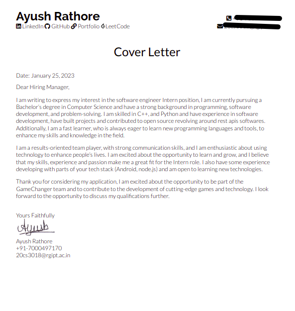

# Resume Template

A single-page, one-column resume for freshers.

The main sections in the resume are

- Education
- Experience
- Projects
- Skills
- Achievements
- Positions of Responsibility

This Resume Template is made up on top of works of Jake's Resume and Sb2nov.

## Why I switched to Latex over G-Docs, Word or ResumeWebsite Builders?

Managing a resume on Google Docs or Word is complex and changing formatting or adding new stuff is cumbersome as we have to apply it in multiple places. Further, most available templates or websites of resume builders don't work well as they don't make proper use of the space available and oftentimes are paid to use properly.

This template is an effort to ease the process of resume building for freshers to build quality resumes easily.

# Showcase

# Deedy Inspired

# Cover Letter

# **Quick start**

Use it as a template on overleaf.

Or use .tex file on your preferred choice of Latex Editor.

# Based on -

[https://github.com/jakegut/resume](https://github.com/jakegut/resume)

[https://github.com/sb2nov/resume/](https://github.com/sb2nov/resume/)
